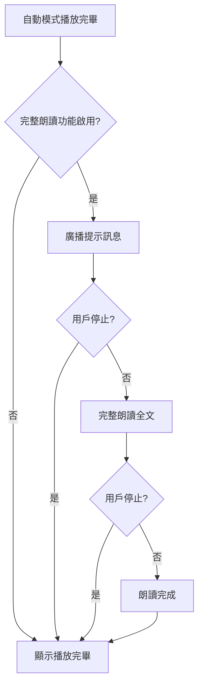
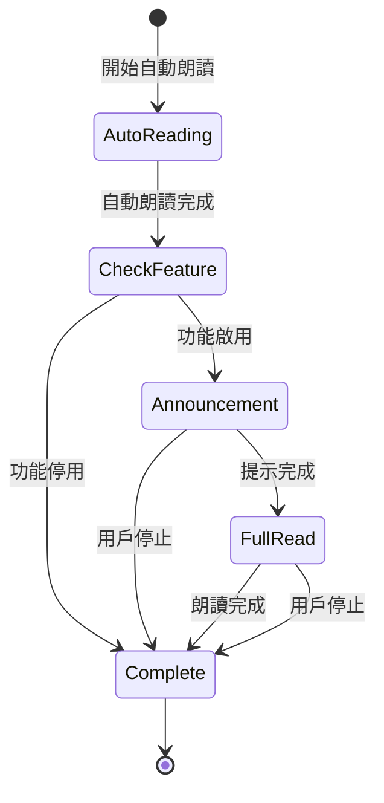

# Design Document: Auto Complete Full Read

## Overview

此功能在自動模式播放完畢後，提供一個可選的「完整朗讀」功能。當啟用時，系統會先廣播提示訊息，然後從頭到尾完整朗讀一次全文內容，忽略重讀次數和書寫時間設定。

## Architecture

### 系統流程



### 狀態流程



## Components and Interfaces

### 1. UI 組件：設定開關

在設定面板中新增完整朗讀開關，位於「朗讀模式」設定之後：

```html
<!-- Full Read Feature Toggle (Requirements 1.1, 1.2) -->
<div class="settings-control-group" id="fullReadControlGroup">
    <label>播放完畢後完整朗讀：</label>
    <div class="segmented-control" id="fullReadSegments" role="radiogroup" aria-label="播放完畢後完整朗讀">
        <button class="segment" data-value="true" role="radio" aria-checked="false">開</button>
        <button class="segment active" data-value="false" role="radio" aria-checked="true">關</button>
    </div>
    <input type="hidden" id="fullReadEnabled" value="false">
    <div class="settings-hint">自動模式播放完畢後，會完整朗讀一次全文</div>
</div>
```

### 2. 核心函數

#### 2.1 取得提示訊息

```javascript
/**
 * 根據語言取得完整朗讀提示訊息
 * @param {string} lang - 語言代碼 (zh-HK, zh-CN, en-GB)
 * @returns {string} 提示訊息
 */
function getFullReadAnnouncementMessage(lang) {
    const messages = {
        'zh-HK': '所有內容朗讀完畢，現在會完整朗讀一次',
        'zh-CN': '所有內容朗讀完畢，现在会完整朗读一次',
        'en-GB': 'All content has been read aloud; now it will be read aloud in full once.'
    };
    return messages[lang] || messages['zh-HK'];
}
```

#### 2.2 執行完整朗讀

```javascript
/**
 * 執行完整朗讀（忽略重讀次數和書寫時間）
 * @param {string} text - 要朗讀的文字
 * @param {string} lang - 語言代碼
 * @param {string} voiceName - 語音名稱
 * @param {string} mode - 模式 (word/article)
 */
async function performFullRead(text, lang, voiceName, mode) {
    const speechRate = mode === 'word' 
        ? parseFloat(document.getElementById('wordSpeechRate').value) || 0.9
        : parseFloat(document.getElementById('speechRate').value) || 0.9;
    
    updateStatus('完整朗讀中', '');
    
    if (mode === 'word') {
        await readWordsOnce(text, lang, voiceName, speechRate);
    } else {
        await readArticleOnce(text, lang, voiceName, speechRate);
    }
}

/**
 * 詞語模式：每個詞語只朗讀一次
 */
async function readWordsOnce(text, lang, voiceName, speechRate) {
    const lines = text.split('\n').map(s => s.trim()).filter(s => s !== "");
    
    for (let i = 0; i < lines.length; i++) {
        if (isStopped) break;
        
        const line = lines[i];
        
        // 更新進度
        const progress = ((i + 1) / lines.length) * 100;
        updateProgressBar(progress);
        
        // 更新狀態
        const statusCount = document.getElementById('statusCount');
        if (statusCount) {
            statusCount.textContent = `完整朗讀 ${i + 1}/${lines.length}`;
        }
        
        // 高亮當前詞語
        HighlightManager.highlightItem(i);
        
        // 朗讀一次（不重複）
        await speakPromise(line, lang, voiceName, speechRate);
    }
}

/**
 * 文章模式：每個句子只朗讀一次
 */
async function readArticleOnce(text, lang, voiceName, speechRate) {
    const punctuationEnabled = document.getElementById('punctuationReadingEnabled').value === 'true';
    const sentences = splitArticleIntoSegments(text, punctuationEnabled);
    
    for (let i = 0; i < sentences.length; i++) {
        if (isStopped) break;
        
        const sentence = sentences[i];
        
        // 更新進度
        const progress = ((i + 1) / sentences.length) * 100;
        updateProgressBar(progress);
        
        // 更新狀態
        const statusCount = document.getElementById('statusCount');
        if (statusCount) {
            statusCount.textContent = `完整朗讀 ${i + 1}/${sentences.length}`;
        }
        
        // 高亮當前句子
        HighlightManager.highlightItem(i);
        
        // 朗讀一次（不重複）
        await speakPromise(sentence, lang, voiceName, speechRate);
    }
}
```

#### 2.3 修改 startReading 函數

```javascript
async function startReading() {
    // ... 現有的驗證和初始化代碼 ...
    
    try {
        if (mode === 'word') {
            await readWords(text, lang, selectedVoice);
        } else {
            await readArticle(text, lang, selectedVoice);
        }

        // 檢查是否需要執行完整朗讀 (Requirements 2.1-2.5, 3.1-3.7)
        const fullReadEnabled = document.getElementById('fullReadEnabled').value === 'true';
        const readingMode = document.getElementById('readingMode').value;
        
        if (!isStopped && fullReadEnabled && readingMode === 'auto') {
            // 廣播提示訊息
            updateStatus('準備完整朗讀...', '');
            const announcementMessage = getFullReadAnnouncementMessage(lang);
            const speechRate = mode === 'word' 
                ? parseFloat(document.getElementById('wordSpeechRate').value) || 0.9
                : parseFloat(document.getElementById('speechRate').value) || 0.9;
            
            await speakPromise(announcementMessage, lang, selectedVoice, speechRate);
            
            // 執行完整朗讀
            if (!isStopped) {
                // 重置進度條
                resetProgress();
                // 重新啟用高亮
                const highlightMode = mode === 'word' ? 'word' : 'article';
                const punctuationEnabled = document.getElementById('punctuationReadingEnabled').value === 'true';
                HighlightManager.switchToDisplayMode(text, highlightMode, punctuationEnabled);
                
                await performFullRead(text, lang, selectedVoice, mode);
            }
        }

        if (!isStopped) {
            updateStatus("播放完畢", '');
        }
    } catch (error) {
        // ... 錯誤處理 ...
    }
    // ... 清理代碼 ...
}
```

### 3. 設定持久化

#### 3.1 saveSettings 修改

```javascript
function saveSettings() {
    const settings = {
        // ... 現有設定 ...
        // 完整朗讀功能開關 (Requirements 1.3, 1.4)
        fullReadEnabled: document.getElementById('fullReadEnabled').value === 'true',
    };
    localStorage.setItem('dictationSettings', JSON.stringify(settings));
}
```

#### 3.2 loadSettings 修改

```javascript
function loadSettings() {
    const saved = localStorage.getItem('dictationSettings');
    if (!saved) return;
    
    try {
        const settings = JSON.parse(saved);
        // ... 現有載入代碼 ...
        
        // 載入完整朗讀設定 (Requirements 1.3, 1.4)
        if (settings.fullReadEnabled !== undefined) {
            document.getElementById('fullReadEnabled').value = settings.fullReadEnabled ? 'true' : 'false';
            updateSegmentedControl('fullReadSegments', settings.fullReadEnabled ? 'true' : 'false');
        }
    } catch (e) {
        console.error('載入設定失敗:', e);
    }
}
```

### 4. 模式切換處理

```javascript
/**
 * 更新完整朗讀控制項的可見性
 * 只在自動模式下顯示 (Requirements 5.1, 5.2)
 */
function updateFullReadControlVisibility() {
    const readingMode = document.getElementById('readingMode').value;
    const fullReadControlGroup = document.getElementById('fullReadControlGroup');
    
    if (fullReadControlGroup) {
        if (readingMode === 'auto') {
            fullReadControlGroup.classList.remove('hidden');
        } else {
            fullReadControlGroup.classList.add('hidden');
        }
    }
}
```

## Data Models

### 設定資料結構

```typescript
interface DictationSettings {
    // 現有設定
    lang: string;
    voice: string;
    mode: 'word' | 'article';
    wordSpeechRate: string;
    repeatCount: string;
    interval: string;
    speechRate: string;
    sentenceRepeat: string;
    charWaitTime: string;
    punctuationReadingEnabled: boolean;
    readingMode: 'auto' | 'manual';
    settingsPanelOpen: boolean;
    debugVisible: boolean;
    textContent: string;
    
    // 新增設定
    fullReadEnabled: boolean;  // 完整朗讀功能開關
}
```

### 提示訊息對照表

| 語言代碼 | 提示訊息 |
|---------|---------|
| zh-HK | 所有內容朗讀完畢，現在會完整朗讀一次 |
| zh-CN | 所有內容朗讀完畢，现在会完整朗读一次 |
| en-GB | All content has been read aloud; now it will be read aloud in full once. |

## Correctness Properties

*A property is a characteristic or behavior that should hold true across all valid executions of a system—essentially, a formal statement about what the system should do. Properties serve as the bridge between human-readable specifications and machine-verifiable correctness guarantees.*

### Property 1: Setting Persistence Round Trip

*For any* fullReadEnabled setting value (true or false), saving to localStorage and then loading SHALL restore the same value.

**Validates: Requirements 1.3, 1.4**

### Property 2: Announcement Message Language Consistency

*For any* supported language (zh-HK, zh-CN, en-GB), the announcement message returned by getFullReadAnnouncementMessage SHALL match the expected message for that language.

**Validates: Requirements 2.1, 2.2, 2.3**

### Property 3: Full Read Ignores Repeat Settings

*For any* repeat count setting (1-10), when performing full read, each item SHALL be read exactly once regardless of the repeat count value.

**Validates: Requirements 3.3**

### Property 4: Full Read Ignores Wait Time Settings

*For any* char wait time setting (0-10 seconds), when performing full read, there SHALL be no additional wait time between items beyond the speech duration.

**Validates: Requirements 3.4**

### Property 5: Mode Restriction

*For any* reading mode, the fullReadControlGroup SHALL be visible only when readingMode is 'auto'.

**Validates: Requirements 5.1, 5.2**

### Property 6: Full Read Uses Current Speech Rate

*For any* speech rate setting, the full read SHALL use the same speech rate as the main content reading.

**Validates: Requirements 2.4, 3.2**

## Error Handling

| 錯誤情況 | 處理方式 |
|---------|---------|
| 語音合成失敗 | 顯示錯誤訊息，跳過完整朗讀 |
| 用戶停止播放 | 立即停止，不繼續完整朗讀 |
| localStorage 不可用 | 使用預設值（關閉），不影響功能 |
| 無效的語言代碼 | 使用預設訊息（粵語） |

## Testing Strategy

### 單元測試

1. **getFullReadAnnouncementMessage 函數測試**
   - 測試各語言返回正確訊息
   - 測試無效語言返回預設訊息

2. **設定持久化測試**
   - 測試 saveSettings 正確儲存 fullReadEnabled
   - 測試 loadSettings 正確載入 fullReadEnabled
   - 測試預設值為 false

3. **模式切換測試**
   - 測試自動模式下控制項可見
   - 測試手動模式下控制項隱藏

### 屬性測試

使用 fast-check 進行屬性測試，每個測試至少執行 100 次迭代。

1. **Property 1: Setting Persistence Round Trip**
   - 生成隨機布林值
   - 儲存後載入應返回相同值

2. **Property 2: Announcement Message Language Consistency**
   - 對所有支援的語言
   - 驗證返回的訊息符合預期

3. **Property 3-6: Full Read Behavior Properties**
   - 生成隨機設定值
   - 驗證完整朗讀行為符合規格

### 測試標籤格式

```javascript
// Feature: auto-complete-full-read, Property 1: Setting Persistence Round Trip
// Validates: Requirements 1.3, 1.4
```
