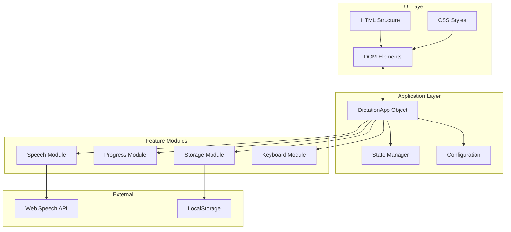

# Design Document: Dictation Tool Enhancement

## Overview

This design document outlines the technical approach for enhancing the Dictation Tool (默書神器) based on the approved requirements. The enhancement focuses on improving user experience through visual feedback, adding new functionality like random playback and import/export, and refactoring the codebase for better maintainability.

The implementation will maintain the single-file HTML structure while introducing a modular JavaScript architecture using an application object pattern.

## Architecture

### High-Level Architecture



### Application Object Structure

The refactored application will use a single `DictationApp` object to encapsulate all functionality:

```javascript
const DictationApp = {
    // Configuration constants
    CONFIG: {
        VOICE_LOAD_DELAY: 200,
        MAX_VOICE_RETRIES: 10,
        PAUSE_CHECK_INTERVAL: 200,
        DEFAULT_SPEECH_RATE: 0.9,
        DEFAULT_REPEAT_COUNT: 3,
        DEFAULT_INTERVAL: 5,
        DEBOUNCE_DELAY: 300
    },
    
    // Application state
    state: {
        isStopped: false,
        isPaused: false,
        isRandomMode: false,
        showCurrentWord: true,
        currentIndex: 0,
        totalItems: 0,
        availableVoices: []
    },
    
    // Cached DOM elements
    elements: {},
    
    // Module methods
    init() {},
    speech: {},
    progress: {},
    storage: {},
    keyboard: {}
};
```

## Components and Interfaces

### 1. Progress Module

Responsible for managing and displaying reading progress.

```javascript
progress: {
    // Update progress bar and text
    update(current, total) {
        const percentage = total > 0 ? (current / total) * 100 : 0;
        this.elements.progressFill.style.width = `${percentage}%`;
        this.elements.progressText.textContent = `${current} / ${total}`;
        this.elements.progressBar.setAttribute('aria-valuenow', percentage);
    },
    
    // Reset progress to initial state
    reset() {
        this.update(0, 0);
    }
}
```

### 2. Current Word Display Module

Manages the prominent display of the currently spoken content.

```javascript
currentWord: {
    // Show the current word/sentence
    show(text) {
        if (this.state.showCurrentWord) {
            this.elements.currentWord.textContent = text;
        }
    },
    
    // Show placeholder message
    showPlaceholder() {
        this.elements.currentWord.textContent = '準備開始...';
    },
    
    // Show completion message
    showComplete() {
        this.elements.currentWord.textContent = '播放完畢';
    },
    
    // Toggle visibility
    setVisible(visible) {
        this.elements.currentWord.classList.toggle('hidden', !visible);
    }
}
```

### 3. Storage Module

Handles localStorage operations with debouncing.

```javascript
storage: {
    saveTimeout: null,
    
    // Debounced save settings
    saveSettings() {
        clearTimeout(this.saveTimeout);
        this.saveTimeout = setTimeout(() => {
            const settings = this.gatherSettings();
            localStorage.setItem('dictationSettings', JSON.stringify(settings));
        }, DictationApp.CONFIG.DEBOUNCE_DELAY);
    },
    
    // Load settings from storage
    loadSettings() {
        const saved = localStorage.getItem('dictationSettings');
        if (!saved) return null;
        try {
            return JSON.parse(saved);
        } catch (e) {
            console.error('Failed to load settings:', e);
            return null;
        }
    },
    
    // Gather current settings from UI
    gatherSettings() {
        return {
            lang: this.elements.langSelect.value,
            voice: this.elements.voiceSelect.value,
            mode: document.querySelector('input[name="mode"]:checked').value,
            randomMode: this.state.isRandomMode,
            showCurrentWord: this.state.showCurrentWord,
            // ... other settings
        };
    }
}
```

### 4. Keyboard Module

Handles keyboard shortcut registration and processing.

```javascript
keyboard: {
    // Initialize keyboard listeners
    init() {
        document.addEventListener('keydown', this.handleKeydown.bind(DictationApp));
    },
    
    // Handle keydown events
    handleKeydown(event) {
        // Skip if focus is in input fields
        if (event.target.tagName === 'TEXTAREA' || 
            event.target.tagName === 'INPUT') {
            return;
        }
        
        switch(event.key) {
            case ' ':  // Space: toggle pause
                event.preventDefault();
                if (!this.elements.pauseBtn.disabled) {
                    this.togglePause();
                }
                break;
            case 'Escape':  // Esc: stop
                if (!this.elements.stopBtn.disabled) {
                    this.stopReading();
                }
                break;
            case 'Enter':  // Enter: start
                if (!this.elements.startBtn.disabled) {
                    this.startReading();
                }
                break;
        }
    }
}
```

### 5. Random Shuffle Module

Implements Fisher-Yates shuffle for random playback.

```javascript
shuffle: {
    // Fisher-Yates shuffle algorithm
    array(arr) {
        const shuffled = [...arr];  // Create copy
        for (let i = shuffled.length - 1; i > 0; i--) {
            const j = Math.floor(Math.random() * (i + 1));
            [shuffled[i], shuffled[j]] = [shuffled[j], shuffled[i]];
        }
        return shuffled;
    }
}
```

### 6. Import/Export Module

Handles file import and export operations.

```javascript
fileIO: {
    // Export word list as text file
    exportWordList() {
        const text = this.elements.words.value;
        const blob = new Blob([text], { type: 'text/plain;charset=utf-8' });
        const url = URL.createObjectURL(blob);
        const a = document.createElement('a');
        a.href = url;
        a.download = '詞表.txt';
        a.click();
        URL.revokeObjectURL(url);
    },
    
    // Import word list from file
    importWordList(file) {
        if (!file.type.match('text.*')) {
            this.showError('請選擇文字檔案 (.txt)');
            return;
        }
        
        const reader = new FileReader();
        reader.onload = (e) => {
            this.elements.words.value = e.target.result;
            this.storage.saveSettings();
        };
        reader.onerror = () => {
            this.showError('讀取檔案失敗');
        };
        reader.readAsText(file, 'UTF-8');
    }
}
```

### 7. Punctuation Reading Module

Handles reading punctuation marks at the end of sentences in article mode.

```javascript
punctuation: {
    // Punctuation to spoken form mapping
    PUNCTUATION_MAP: {
        // Chinese punctuation
        '。': '句號',
        '！': '感嘆號',
        '？': '問號',
        '；': '分號',
        '，': '逗號',
        '、': '頓號',
        '．': '點',
        '：': '冒號',
        '「': '左引號',
        '」': '右引號',
        '『': '左雙引號',
        '』': '右雙引號',
        '（': '左括號',
        '）': '右括號',
        '……': '省略號',
        '——': '破折號',
        // English punctuation
        '.': '句點',
        '!': '感嘆號',
        '?': '問號',
        ';': '分號',
        ',': '逗號',
        ':': '冒號'
    },
    
    // Extract trailing punctuation from a sentence
    extractTrailingPunctuation(sentence) {
        const punctuationPattern = /[。！？；，、．.!?;,：:「」『』（）]+$/;
        const match = sentence.match(punctuationPattern);
        return match ? match[0] : '';
    },
    
    // Convert punctuation string to spoken form
    toSpokenForm(punctuation) {
        if (!punctuation) return '';
        
        const spokenParts = [];
        // Handle multi-character punctuation first (e.g., ……, ——)
        let remaining = punctuation;
        
        // Check for multi-char punctuation
        const multiCharPunc = ['……', '——'];
        for (const punc of multiCharPunc) {
            while (remaining.includes(punc)) {
                const idx = remaining.indexOf(punc);
                // Process chars before this multi-char punctuation
                for (let i = 0; i < idx; i++) {
                    const char = remaining[i];
                    if (this.PUNCTUATION_MAP[char]) {
                        spokenParts.push(this.PUNCTUATION_MAP[char]);
                    }
                }
                // Add the multi-char punctuation
                if (this.PUNCTUATION_MAP[punc]) {
                    spokenParts.push(this.PUNCTUATION_MAP[punc]);
                }
                remaining = remaining.substring(0, idx) + remaining.substring(idx + punc.length);
            }
        }
        
        // Process remaining single characters
        for (const char of remaining) {
            if (this.PUNCTUATION_MAP[char]) {
                spokenParts.push(this.PUNCTUATION_MAP[char]);
            }
        }
        
        return spokenParts.join('，');
    },
    
    // Get the text to speak including punctuation
    getSentenceWithPunctuation(sentence) {
        const trailingPunc = this.extractTrailingPunctuation(sentence);
        const spokenPunc = this.toSpokenForm(trailingPunc);
        
        if (spokenPunc) {
            return sentence + '，' + spokenPunc;
        }
        return sentence;
    }
}
```

## Data Models

### Application State

```typescript
interface AppState {
    isStopped: boolean;      // Whether reading has been stopped
    isPaused: boolean;       // Whether reading is paused
    isRandomMode: boolean;   // Whether random playback is enabled
    showCurrentWord: boolean; // Whether to show current word display
    currentIndex: number;    // Current item index (0-based)
    totalItems: number;      // Total number of items to read
    availableVoices: SpeechSynthesisVoice[];  // Available voices
}
```

### Settings Model

```typescript
interface Settings {
    lang: string;            // Selected language code
    voice: string;           // Selected voice name or 'auto'
    mode: 'word' | 'article'; // Reading mode
    randomMode: boolean;     // Random playback preference
    showCurrentWord: boolean; // Show current word preference
    wordSpeechRate: string;  // Speech rate for word mode
    repeatCount: string;     // Repeat count per word
    interval: string;        // Interval between words
    speechRate: string;      // Speech rate for article mode
    sentenceRepeat: string;  // Repeat count per sentence
    charWaitTime: string;    // Wait time per character
}
```

## Correctness Properties

*A property is a characteristic or behavior that should hold true across all valid executions of a system—essentially, a formal statement about what the system should do. Properties serve as the bridge between human-readable specifications and machine-verifiable correctness guarantees.*

Based on the prework analysis of acceptance criteria, the following non-redundant properties have been identified:

### Property 1: Progress Calculation Accuracy

*For any* reading session with total items N (where N > 0) and current completed items K (where 0 ≤ K ≤ N), the progress percentage should equal (K / N) * 100, and the progress text should display "K / N".

**Validates: Requirements 1.2, 1.4**

### Property 2: Shuffle Preserves Elements

*For any* word list array, shuffling should produce a result where:
- The length equals the original array length
- Sorting both arrays produces identical results (same elements)
- The original array remains unchanged (immutability)

**Validates: Requirements 3.1, 3.3**

### Property 3: Settings Round-Trip

*For any* valid settings object containing all preference fields (lang, voice, mode, randomMode, showCurrentWord, rates, counts, intervals), serializing to JSON, saving to localStorage, loading from localStorage, and deserializing should produce an equivalent settings object.

**Validates: Requirements 3.4, 10.3**

### Property 4: Keyboard Shortcuts Respect Focus

*For any* keyboard event where the event target's tagName is 'TEXTAREA' or 'INPUT', the keyboard handler should return early without calling any action functions (togglePause, stopReading, startReading) and without calling preventDefault().

**Validates: Requirements 4.4**

### Property 5: File Content Round-Trip

*For any* string containing Chinese characters (Unicode range \u4e00-\u9fff), creating a Blob with UTF-8 encoding and reading it back should produce the exact same string.

**Validates: Requirements 6.5**

### Property 6: ARIA Progress Attributes

*For any* progress update with value V (0 ≤ V ≤ 100), the progress bar element should have:
- `role="progressbar"`
- `aria-valuenow` equal to V
- `aria-valuemin` equal to 0
- `aria-valuemax` equal to 100

**Validates: Requirements 9.1**

### Property 7: Punctuation Mapping Completeness

*For any* punctuation character in the supported set (。！？；，、．.!?;,：:), the PUNCTUATION_MAP should return a non-empty spoken form string.

**Validates: Requirements 11.3, 11.4**

### Property 8: Punctuation Extraction Preserves Order

*For any* sentence ending with multiple punctuation marks, extractTrailingPunctuation should return all trailing punctuation characters in their original order.

**Validates: Requirements 11.1, 11.2**

### Property 9: Punctuation Spoken Form Round-Trip

*For any* sentence with trailing punctuation, the spoken form output should contain spoken representations for each punctuation mark in the original order.

**Validates: Requirements 11.2, 11.3**

## Error Handling

### Error Categories

1. **Browser Compatibility Errors**
   - Speech synthesis not supported
   - LocalStorage not available
   - File API not supported

2. **User Input Errors**
   - Empty word list
   - Invalid file type for import
   - Invalid numeric input values

3. **Runtime Errors**
   - Speech synthesis failures
   - File read failures
   - Voice loading failures

### Error Display Strategy

```javascript
showError(message, type = 'warning') {
    const status = this.elements.status;
    status.className = `status ${type}`;
    status.textContent = message;
    
    // Auto-clear error messages after 5 seconds
    if (type === 'error') {
        setTimeout(() => {
            status.className = 'status';
            status.textContent = '';
        }, 5000);
    }
}
```

### CSS Error Styles

```css
.status.error { color: #dc3545; }
.status.warning { color: #ffc107; }
.status.success { color: #28a745; }
```

## Testing Strategy

### Unit Tests

Unit tests will verify specific functionality:

1. **Shuffle Function Tests**
   - Empty array returns empty array
   - Single element array returns same element
   - Array length preserved after shuffle

2. **Progress Calculation Tests**
   - 0/10 = 0%
   - 5/10 = 50%
   - 10/10 = 100%
   - Edge case: 0/0 = 0%

3. **Settings Serialization Tests**
   - All fields preserved after JSON round-trip
   - Invalid JSON handled gracefully

4. **Keyboard Handler Tests**
   - Space key triggers pause when reading
   - Escape key triggers stop when reading
   - Keys ignored when in input field

5. **Punctuation Module Tests**
   - Single punctuation mark returns correct spoken form
   - Multiple punctuation marks return all spoken forms in order
   - Sentence without punctuation returns empty string
   - Mixed Chinese and English punctuation handled correctly

### Property-Based Tests

Property-based tests will use fast-check library to verify universal properties:

1. **Property 1: Progress Calculation Accuracy**
   - Generate random (current, total) pairs where 0 ≤ current ≤ total
   - Verify percentage = (current / total) * 100
   - Verify text format "current / total"
   - **Feature: dictation-tool-enhancement, Property 1: Progress Calculation Accuracy**

2. **Property 2: Shuffle Preserves Elements**
   - Generate random string arrays
   - Verify shuffled.length === original.length
   - Verify sorted(shuffled) deep equals sorted(original)
   - Verify original array unchanged
   - **Feature: dictation-tool-enhancement, Property 2: Shuffle Preserves Elements**

3. **Property 3: Settings Round-Trip**
   - Generate random valid settings objects
   - Verify JSON.parse(JSON.stringify(settings)) deep equals settings
   - **Feature: dictation-tool-enhancement, Property 3: Settings Round-Trip**

4. **Property 4: Keyboard Shortcuts Respect Focus**
   - Generate random key events with target tagName in ['TEXTAREA', 'INPUT', 'BUTTON', 'DIV']
   - Verify handler returns early for TEXTAREA/INPUT targets
   - **Feature: dictation-tool-enhancement, Property 4: Keyboard Shortcuts Respect Focus**

5. **Property 5: File Content Round-Trip**
   - Generate random strings with Chinese characters
   - Verify Blob creation and FileReader produces identical string
   - **Feature: dictation-tool-enhancement, Property 5: File Content Round-Trip**

6. **Property 6: ARIA Progress Attributes**
   - Generate random progress values 0-100
   - Verify all ARIA attributes are set correctly
   - **Feature: dictation-tool-enhancement, Property 6: ARIA Progress Attributes**

7. **Property 7: Punctuation Mapping Completeness**
   - For each punctuation in supported set
   - Verify PUNCTUATION_MAP returns non-empty string
   - **Feature: dictation-tool-enhancement, Property 7: Punctuation Mapping Completeness**

8. **Property 8: Punctuation Extraction Preserves Order**
   - Generate random sentences with 1-3 trailing punctuation marks
   - Verify extracted punctuation matches original order
   - **Feature: dictation-tool-enhancement, Property 8: Punctuation Extraction Preserves Order**

9. **Property 9: Punctuation Spoken Form Round-Trip**
   - Generate random punctuation combinations
   - Verify spoken form contains all punctuation representations in order
   - **Feature: dictation-tool-enhancement, Property 9: Punctuation Spoken Form Round-Trip**

### Test Configuration

- Property tests: minimum 100 iterations per property
- Test framework: Jest with fast-check for property-based testing
- Each property test tagged with feature name and property number as shown above
