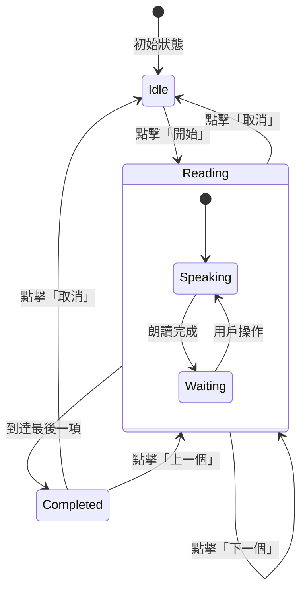

# Design Document: Manual Reading Mode

## Overview

本設計文件描述「默書神器」手動朗讀模式的技術實現方案。手動朗讀模式允許使用者透過按鈕控制朗讀進度，逐詞/逐句操作，與現有的自動朗讀模式並存。

## Architecture

### 系統架構

```
┌─────────────────────────────────────────────────────────────┐
│                    User Interface Layer                      │
├─────────────────────────────────────────────────────────────┤
│  ┌─────────────────┐  ┌─────────────────────────────────┐   │
│  │ Reading Mode    │  │ Player Controls                 │   │
│  │ Toggle          │  │ ┌─────────────────────────────┐ │   │
│  │ (自動/手動)     │  │ │ Auto: 開始│暫停│取消        │ │   │
│  └─────────────────┘  │ │ Manual: ◀│▶/重讀│✕│▶       │ │   │
│                       │ └─────────────────────────────┘ │   │
│                       └─────────────────────────────────┘   │
├─────────────────────────────────────────────────────────────┤
│                    State Management Layer                    │
├─────────────────────────────────────────────────────────────┤
│  ┌─────────────────┐  ┌─────────────────────────────────┐   │
│  │ ManualReading   │  │ Existing State                  │   │
│  │ State           │  │ - isStopped                     │   │
│  │ - readingMode   │  │ - isPaused                      │   │
│  │ - currentIndex  │  │ - progressState                 │   │
│  │ - hasStarted    │  │ - HighlightManager              │   │
│  │ - isReading     │  │                                 │   │
│  └─────────────────┘  └─────────────────────────────────┘   │
├─────────────────────────────────────────────────────────────┤
│                    Speech Synthesis Layer                    │
├─────────────────────────────────────────────────────────────┤
│  ┌─────────────────────────────────────────────────────────┐│
│  │ speakPromise() - 現有語音合成函數                       ││
│  └─────────────────────────────────────────────────────────┘│
└─────────────────────────────────────────────────────────────┘
```

### 狀態流程圖



## Components and Interfaces

### 1. ManualReadingState 物件

管理手動朗讀模式的狀態。

```javascript
const ManualReadingState = {
    // 朗讀模式: 'auto' | 'manual'
    readingMode: 'auto',
    
    // 當前朗讀索引
    currentIndex: -1,
    
    // 是否已開始朗讀
    hasStarted: false,
    
    // 是否正在朗讀中（語音合成進行中）
    isReading: false,
    
    // 分割後的項目陣列（包含 type 和 content）
    items: [],
    
    // 總項目數
    totalItems: 0,
    
    // 重置狀態
    reset() {
        this.currentIndex = -1;
        this.hasStarted = false;
        this.isReading = false;
        this.items = [];
        this.totalItems = 0;
    },
    
    // 初始化項目
    initItems(text, mode, punctuationReadingEnabled = true) {
        if (mode === 'word') {
            // 詞語模式：按行分割，每個都是文字類型
            this.items = text.split('\n')
                .map(s => s.trim())
                .filter(s => s !== '')
                .map(s => ({ type: 'text', content: s }));
        } else {
            // 文章模式：使用 splitArticleSegments
            const segments = splitArticleSegments(text);
            if (punctuationReadingEnabled) {
                // 包含標點符號
                this.items = segments;
            } else {
                // 只取文字段落
                this.items = segments.filter(s => s.type === 'text');
            }
        }
        this.totalItems = this.items.length;
        return this.items;
    },
    
    // 取得當前項目
    getCurrentItem() {
        if (this.currentIndex >= 0 && this.currentIndex < this.items.length) {
            return this.items[this.currentIndex];
        }
        return null;
    },
    
    // 移動到下一個
    moveNext() {
        if (this.currentIndex < this.items.length - 1) {
            this.currentIndex++;
            return true;
        }
        return false;
    },
    
    // 移動到上一個
    movePrevious() {
        if (this.currentIndex > 0) {
            this.currentIndex--;
            return true;
        }
        return false; // 已在第一個
    },
    
    // 是否在第一個
    isAtFirst() {
        return this.currentIndex <= 0;
    },
    
    // 是否在最後一個
    isAtLast() {
        return this.currentIndex >= this.items.length - 1;
    }
};
```

### 2. UI 組件

#### 2.1 朗讀模式切換 (Reading Mode Toggle)

在朗讀設定面板中加入模式切換控制項。

```html
<!-- 在 settings-content 內加入 -->
<div class="settings-control-group">
    <label>朗讀模式：</label>
    <div class="segmented-control" id="readingModeSegments" role="radiogroup" aria-label="朗讀模式">
        <div class="segment-indicator"></div>
        <button class="segment active" data-value="auto" role="radio" aria-checked="true">自動朗讀</button>
        <button class="segment" data-value="manual" role="radio" aria-checked="false">手動朗讀</button>
    </div>
</div>
<input type="hidden" id="readingMode" value="auto">
```

#### 2.2 手動控制按鈕組

```html
<!-- 手動朗讀控制按鈕 (預設隱藏) -->
<div class="player-controls manual-controls hidden" id="manualControls" role="group" aria-label="手動播放控制">
    <button id="prevBtn" onclick="manualPrevious()" disabled aria-label="上一個">
        <svg viewBox="0 0 24 24" fill="currentColor"><path d="M15.41 7.41L14 6l-6 6 6 6 1.41-1.41L10.83 12z"/></svg>
        上一個
    </button>
    <button id="manualStartBtn" onclick="manualStartOrReplay()" aria-label="開始朗讀">
        <svg viewBox="0 0 24 24" fill="currentColor"><path d="M8 5v14l11-7z"/></svg>
        <span id="manualStartBtnText">開始</span>
    </button>
    <button id="manualStopBtn" onclick="manualStop()" disabled aria-label="取消朗讀">
        <svg viewBox="0 0 24 24" fill="currentColor"><path d="M19 6.41L17.59 5 12 10.59 6.41 5 5 6.41 10.59 12 5 17.59 6.41 19 12 13.41 17.59 19 19 17.59 13.41 12z"/></svg>
        取消
    </button>
    <button id="nextBtn" onclick="manualNext()" disabled aria-label="下一個">
        下一個
        <svg viewBox="0 0 24 24" fill="currentColor"><path d="M10 6L8.59 7.41 13.17 12l-4.58 4.59L10 18l6-6z"/></svg>
    </button>
</div>
```

### 3. 核心函數

#### 3.1 模式切換函數

```javascript
/**
 * 切換朗讀模式
 * @param {string} mode - 'auto' 或 'manual'
 */
function switchReadingMode(mode) {
    // 如果正在朗讀，先停止
    if (ManualReadingState.hasStarted || !isStopped) {
        stopReading();
        manualStop();
    }
    
    ManualReadingState.readingMode = mode;
    
    // 切換控制按鈕顯示
    const autoControls = document.querySelector('.player-controls:not(.manual-controls)');
    const manualControls = document.getElementById('manualControls');
    
    if (mode === 'manual') {
        autoControls.classList.add('hidden');
        manualControls.classList.remove('hidden');
    } else {
        autoControls.classList.remove('hidden');
        manualControls.classList.add('hidden');
    }
    
    // 更新鍵盤提示
    updateKeyboardHint(mode);
    
    // 儲存設定
    saveSettings();
}
```

#### 3.2 手動朗讀控制函數

```javascript
/**
 * 手動模式：開始或重讀
 */
async function manualStartOrReplay() {
    const mode = document.querySelector('input[name="mode"]:checked').value;
    const rawText = document.getElementById('words').value;
    const text = sanitizeInput(rawText);
    const lang = document.getElementById('langSelect').value;
    const selectedVoice = document.getElementById('voiceSelect').value;
    
    // 空狀態檢查
    if (text.trim() === '') {
        showEmptyInputError();
        return;
    }
    
    // 語言驗證
    const validation = validateTextForLanguage(text, lang);
    if (!validation.valid) {
        showValidationError(validation.errorMessage);
        return;
    }
    
    if (!ManualReadingState.hasStarted) {
        // 首次開始
        ManualReadingState.initItems(text, mode);
        ManualReadingState.currentIndex = 0;
        ManualReadingState.hasStarted = true;
        
        // 切換到顯示模式
        const highlightMode = mode === 'word' ? 'word' : 'article';
        HighlightManager.switchToDisplayMode(text, highlightMode);
        
        // 更新按鈕狀態
        updateManualButtonStates();
        updateManualStartButtonLabel();
    }
    
    // 朗讀當前項目
    await readCurrentItem(lang, selectedVoice);
}

/**
 * 手動模式：下一個
 */
async function manualNext() {
    if (!ManualReadingState.hasStarted || ManualReadingState.isReading) return;
    
    if (ManualReadingState.moveNext()) {
        updateManualProgress();
        updateManualButtonStates();
        
        const lang = document.getElementById('langSelect').value;
        const selectedVoice = document.getElementById('voiceSelect').value;
        await readCurrentItem(lang, selectedVoice);
    }
}

/**
 * 手動模式：上一個
 */
async function manualPrevious() {
    if (!ManualReadingState.hasStarted || ManualReadingState.isReading) return;
    
    ManualReadingState.movePrevious(); // 即使在第一個也會返回 false，但不影響
    updateManualProgress();
    updateManualButtonStates();
    
    const lang = document.getElementById('langSelect').value;
    const selectedVoice = document.getElementById('voiceSelect').value;
    await readCurrentItem(lang, selectedVoice);
}

/**
 * 手動模式：取消
 */
function manualStop() {
    // 停止語音
    synth.cancel();
    
    // 重置狀態
    ManualReadingState.reset();
    
    // 切換回編輯模式
    HighlightManager.switchToEditMode();
    
    // 重置進度條
    resetProgress();
    
    // 更新按鈕狀態
    updateManualButtonStates();
    updateManualStartButtonLabel();
    
    // 清除狀態顯示
    updateStatus('', '');
}

/**
 * 朗讀當前項目
 */
async function readCurrentItem(lang, selectedVoice) {
    const item = ManualReadingState.getCurrentItem();
    if (!item) return;
    
    ManualReadingState.isReading = true;
    updateManualButtonStates();
    
    // 更新高亮
    HighlightManager.highlightItem(ManualReadingState.currentIndex);
    
    // 取得語速設定
    const mode = document.querySelector('input[name="mode"]:checked').value;
    const speechRate = mode === 'word' 
        ? parseFloat(document.getElementById('wordSpeechRate').value) || 0.9
        : parseFloat(document.getElementById('speechRate').value) || 0.9;
    
    // 根據項目類型決定朗讀內容
    let textToSpeak;
    if (item.type === 'punct') {
        // 標點符號：朗讀標點名稱
        textToSpeak = getPunctuationName(item.content, lang);
        updateStatus(`正在朗讀：${textToSpeak}`, '');
    } else {
        // 文字：直接朗讀
        textToSpeak = item.content;
        updateStatus(`正在朗讀：${item.content}`, '');
    }
    
    try {
        await speakPromise(textToSpeak, lang, selectedVoice, speechRate);
    } catch (error) {
        console.error('朗讀錯誤:', error);
    }
    
    ManualReadingState.isReading = false;
    updateManualButtonStates();
    
    // 檢查是否完成所有項目
    if (ManualReadingState.isAtLast()) {
        updateStatus('播放完畢', '');
    }
}
```

#### 3.3 UI 更新函數

```javascript
/**
 * 更新手動模式按鈕狀態
 */
function updateManualButtonStates() {
    const prevBtn = document.getElementById('prevBtn');
    const nextBtn = document.getElementById('nextBtn');
    const manualStartBtn = document.getElementById('manualStartBtn');
    const manualStopBtn = document.getElementById('manualStopBtn');
    
    const hasStarted = ManualReadingState.hasStarted;
    const isReading = ManualReadingState.isReading;
    const isAtFirst = ManualReadingState.isAtFirst();
    const isAtLast = ManualReadingState.isAtLast();
    
    // 上一個按鈕：未開始時禁用，朗讀中禁用，第一個項目時禁用
    prevBtn.disabled = !hasStarted || isReading || isAtFirst;
    
    // 下一個按鈕：未開始時禁用，朗讀中禁用，最後一個時禁用
    nextBtn.disabled = !hasStarted || isReading || isAtLast;
    
    // 開始/重讀按鈕：朗讀中禁用
    manualStartBtn.disabled = isReading;
    
    // 取消按鈕：未開始時禁用
    manualStopBtn.disabled = !hasStarted;
}

/**
 * 更新開始/重讀按鈕標籤
 */
function updateManualStartButtonLabel() {
    const btnText = document.getElementById('manualStartBtnText');
    if (ManualReadingState.hasStarted) {
        btnText.textContent = '重讀';
    } else {
        btnText.textContent = '開始';
    }
}

/**
 * 更新手動模式進度
 */
function updateManualProgress() {
    const current = ManualReadingState.currentIndex + 1;
    const total = ManualReadingState.totalItems;
    
    // 更新進度條
    const percentage = total > 0 ? (current / total) * 100 : 0;
    const progressFill = document.getElementById('progressFill');
    if (progressFill) {
        progressFill.style.width = percentage + '%';
    }
    
    // 更新狀態計數
    const mode = document.querySelector('input[name="mode"]:checked').value;
    const statusCount = document.getElementById('statusCount');
    if (statusCount) {
        const label = mode === 'word' ? '詞語' : '句子';
        statusCount.textContent = `${label} ${current}/${total} 個`;
    }
    
    // 更新 ARIA
    updateProgressBarAria(current, total);
}

/**
 * 更新鍵盤提示
 */
function updateKeyboardHint(mode) {
    const hint = document.querySelector('.keyboard-hint');
    if (!hint) return;
    
    if (mode === 'manual') {
        hint.innerHTML = '快捷鍵：<kbd>Space</kbd> 開始/重讀 · <kbd>←</kbd> 上一個 · <kbd>→</kbd> 下一個 · <kbd>Esc</kbd> 取消';
    } else {
        hint.innerHTML = '快捷鍵：<kbd>Space</kbd> 開始/暫停 · <kbd>Esc</kbd> 停止';
    }
}
```

#### 3.4 鍵盤快捷鍵處理

```javascript
/**
 * 手動模式鍵盤事件處理
 */
function handleManualKeyboard(e) {
    // 檢查是否在輸入框中
    const isInputFocused = ['INPUT', 'TEXTAREA', 'SELECT'].includes(document.activeElement.tagName);
    if (isInputFocused) return;
    
    // 檢查是否為手動模式
    if (ManualReadingState.readingMode !== 'manual') return;
    
    switch (e.code) {
        case 'Space':
            e.preventDefault();
            if (!document.getElementById('manualStartBtn').disabled) {
                manualStartOrReplay();
            }
            break;
        case 'ArrowRight':
            e.preventDefault();
            if (!document.getElementById('nextBtn').disabled) {
                manualNext();
            }
            break;
        case 'ArrowLeft':
            e.preventDefault();
            if (!document.getElementById('prevBtn').disabled) {
                manualPrevious();
            }
            break;
        case 'Escape':
            e.preventDefault();
            if (!document.getElementById('manualStopBtn').disabled) {
                manualStop();
            }
            break;
    }
}
```

## Data Models

### 設定儲存結構

擴展現有的 localStorage 設定結構：

```javascript
{
    // 現有設定...
    mode: 'word',
    lang: 'zh-HK',
    wordSpeechRate: '0.9',
    // ...
    
    // 新增設定
    readingMode: 'auto'  // 'auto' | 'manual'
}
```

### 狀態模型

```javascript
// ManualReadingState 狀態結構
{
    readingMode: string,    // 'auto' | 'manual'
    currentIndex: number,   // -1 表示未開始
    hasStarted: boolean,    // 是否已開始朗讀
    isReading: boolean,     // 是否正在朗讀中
    items: string[],        // 分割後的項目
    totalItems: number      // 總項目數
}
```

## Correctness Properties

*A property is a characteristic or behavior that should hold true across all valid executions of a system—essentially, a formal statement about what the system should do. Properties serve as the bridge between human-readable specifications and machine-verifiable correctness guarantees.*

### Property 1: Control Visibility Matches Reading Mode

*For any* reading mode value ('auto' or 'manual'), the visible control buttons SHALL match the selected mode - auto controls visible when mode is 'auto', manual controls visible when mode is 'manual'.

**Validates: Requirements 1.3, 1.4, 2.2**

### Property 2: Reading Mode Persistence Round Trip

*For any* reading mode selection, saving to localStorage and then loading SHALL restore the same reading mode value.

**Validates: Requirements 1.5, 1.6**

### Property 3: Index Navigation Bounds

*For any* sequence of next/previous operations, the currentIndex SHALL always remain within bounds [0, totalItems - 1] after hasStarted is true.

**Validates: Requirements 4.2, 5.2, 5.3**

### Property 4: Button State Consistency

*For any* ManualReadingState, the button disabled states SHALL be consistent with the state:
- prevBtn disabled when !hasStarted OR isReading OR isAtFirst
- nextBtn disabled when !hasStarted OR isReading OR isAtLast
- manualStartBtn disabled when isReading
- manualStopBtn disabled when !hasStarted

**Validates: Requirements 3.5, 4.1, 4.4, 5.1, 5.2, 5.7, 6.1**

### Property 5: Highlight Follows Index

*For any* navigation operation (start, next, previous), the highlighted item index SHALL equal currentIndex.

**Validates: Requirements 3.6, 4.6, 5.6**

### Property 6: Progress Reflects Index

*For any* currentIndex value, the progress bar percentage SHALL equal ((currentIndex + 1) / totalItems) * 100.

**Validates: Requirements 4.5, 5.5, 7.3**

### Property 7: Start Button Label State

*For any* ManualReadingState, the start button label SHALL be "開始" when hasStarted is false, and "重讀" when hasStarted is true.

**Validates: Requirements 3.1, 3.3, 6.6**

### Property 8: Text Preservation on Mode Switch

*For any* text content in the textarea, switching between auto and manual reading modes SHALL preserve the text content unchanged.

**Validates: Requirements 8.4**

### Property 9: Keyboard Action Mapping

*For any* keyboard event in manual mode (when no input is focused), the action triggered SHALL match:
- Space → manualStartOrReplay
- ArrowRight → manualNext
- ArrowLeft → manualPrevious
- Escape → manualStop

**Validates: Requirements 9.2, 9.3, 9.4, 9.5**

### Property 10: Cancel Resets All State

*For any* state where hasStarted is true, calling manualStop() SHALL result in:
- currentIndex = -1
- hasStarted = false
- isReading = false
- progress bar at 0%
- edit mode active (textarea visible)

**Validates: Requirements 6.2, 6.3, 6.4, 6.5**

### Property 11: Punctuation Segments Included When Enabled

*For any* article text with punctuation marks, when punctuation reading is enabled, the items array SHALL include both text and punctuation segments in the correct order.

**Validates: Requirements 10.1, 10.3, 10.5**

### Property 12: Punctuation Segments Skipped When Disabled

*For any* article text with punctuation marks, when punctuation reading is disabled, the items array SHALL only include text segments (no punctuation).

**Validates: Requirements 10.4**

## Error Handling

### 1. 空輸入處理

```javascript
function showEmptyInputError() {
    updateStatus('請先輸入內容', '');
    const textarea = document.getElementById('words');
    textarea.focus();
    textarea.classList.add('input-error');
    setTimeout(() => textarea.classList.remove('input-error'), 2000);
}
```

### 2. 語言驗證錯誤

```javascript
function showValidationError(message) {
    showErrorToast(message);
    const textarea = document.getElementById('words');
    textarea.focus();
    textarea.classList.add('input-error');
    setTimeout(() => textarea.classList.remove('input-error'), 2000);
}
```

### 3. 語音合成錯誤

在 `readCurrentItem` 中使用 try-catch 捕獲語音合成錯誤，並更新狀態顯示。

### 4. 模式切換中斷處理

切換模式時，如果正在朗讀，先停止當前朗讀並重置狀態，避免狀態不一致。

## Testing Strategy

### 單元測試

使用 Vitest 進行單元測試，測試以下功能：

1. **ManualReadingState 狀態管理**
   - `initItems()` 正確分割文字
   - `moveNext()` 和 `movePrevious()` 正確更新索引
   - `isAtFirst()` 和 `isAtLast()` 正確判斷邊界
   - `reset()` 正確重置所有狀態

2. **UI 狀態更新**
   - `updateManualButtonStates()` 正確設定按鈕狀態
   - `updateManualStartButtonLabel()` 正確更新標籤
   - `updateManualProgress()` 正確計算進度

### 屬性測試

使用 fast-check 進行屬性測試，每個測試至少執行 100 次迭代。

測試標籤格式：**Feature: manual-reading-mode, Property {number}: {property_text}**

1. **Property 1**: 控制按鈕可見性與模式一致
2. **Property 2**: 朗讀模式設定的儲存/載入往返一致性
3. **Property 3**: 索引導航邊界檢查
4. **Property 4**: 按鈕狀態與 ManualReadingState 一致性
5. **Property 5**: 高亮跟隨索引
6. **Property 6**: 進度條反映索引
7. **Property 7**: 開始按鈕標籤狀態
8. **Property 8**: 模式切換時文字內容保持不變
9. **Property 9**: 鍵盤動作映射
10. **Property 10**: 取消操作重置所有狀態

### 整合測試

1. 完整的手動朗讀流程測試
2. 模式切換測試
3. 鍵盤快捷鍵測試
