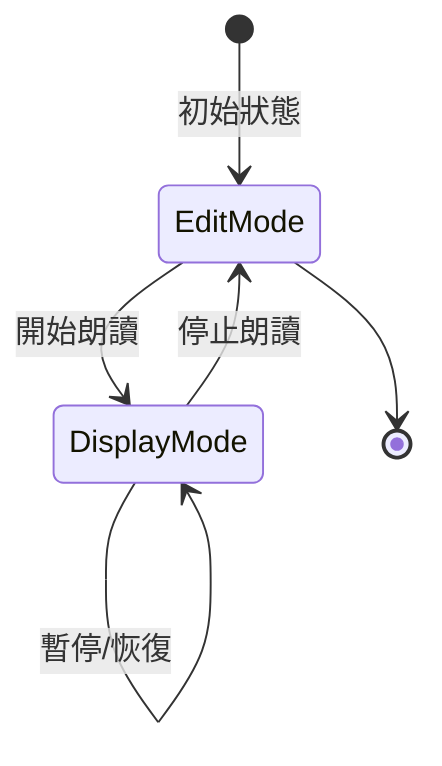

# Design Document: Text Highlight During Speech

## Overview

此功能為默書神器新增文字高亮功能，在朗讀時於文字顯示區域高亮顯示正在朗讀的詞語或句子。實作方式是在朗讀開始時，將原本的 `<textarea>` 暫時替換為一個可高亮的 `<div>` 顯示區域，朗讀結束後再恢復為可編輯的 textarea。

## Architecture

### 高層架構

```
┌─────────────────────────────────────────────────────────┐
│                    User Interface                        │
├─────────────────────────────────────────────────────────┤
│  ┌─────────────────┐    ┌─────────────────────────────┐ │
│  │    Textarea     │◄──►│     Text Display (div)      │ │
│  │   (編輯模式)     │    │      (朗讀模式)              │ │
│  └─────────────────┘    └─────────────────────────────┘ │
├─────────────────────────────────────────────────────────┤
│                  Highlight Manager                       │
│  ┌─────────────────────────────────────────────────────┐│
│  │ - switchToDisplayMode()                             ││
│  │ - switchToEditMode()                                ││
│  │ - highlightItem(index)                              ││
│  │ - clearHighlight()                                  ││
│  │ - scrollToHighlight()                               ││
│  └─────────────────────────────────────────────────────┘│
├─────────────────────────────────────────────────────────┤
│                  Speech Controller                       │
│  ┌─────────────────────────────────────────────────────┐│
│  │ - speakPromise() (existing)                         ││
│  │ - Integration with Highlight Manager                ││
│  └─────────────────────────────────────────────────────┘│
└─────────────────────────────────────────────────────────┘
```

### 模式切換流程



## Components and Interfaces

### 1. HighlightManager 模組

負責管理文字顯示和高亮狀態的核心模組。

```javascript
const HighlightManager = {
    // 狀態
    isDisplayMode: false,
    currentHighlightIndex: -1,
    displayContainer: null,
    originalTextarea: null,
    items: [],  // 分割後的詞語或句子陣列
    
    // 初始化顯示容器
    init() {},
    
    // 切換到顯示模式（朗讀開始時）
    switchToDisplayMode(text, mode) {},
    
    // 切換回編輯模式（朗讀結束時）
    switchToEditMode() {},
    
    // 高亮指定索引的項目
    highlightItem(index) {},
    
    // 清除所有高亮
    clearHighlight() {},
    
    // 捲動到高亮項目
    scrollToHighlight() {},
    
    // 根據模式分割文字
    splitText(text, mode) {}
};
```

### 2. 介面定義

#### switchToDisplayMode(text, mode)
- **參數**: 
  - `text`: 要顯示的文字內容
  - `mode`: 'word' 或 'article'
- **行為**: 
  - 隱藏 textarea
  - 建立並顯示 displayContainer
  - 根據模式分割文字並建立可高亮元素
- **回傳**: void

#### switchToEditMode()
- **參數**: 無
- **行為**:
  - 隱藏 displayContainer
  - 顯示 textarea
  - 重置高亮狀態
- **回傳**: void

#### highlightItem(index)
- **參數**: `index` - 要高亮的項目索引
- **行為**:
  - 移除前一個高亮
  - 為指定索引的元素添加高亮樣式
  - 自動捲動到可見區域
- **回傳**: void

### 3. CSS 樣式

```css
/* 文字顯示容器 */
.text-display-container {
    width: 100%;
    min-height: 100px;
    max-height: 300px;
    overflow-y: auto;
    padding: var(--spacing-md);
    border: 1px solid var(--color-border);
    border-radius: var(--radius-md);
    background: var(--color-surface);
    font-size: var(--font-size-md);
    line-height: 1.8;
    box-sizing: border-box;
}

/* 可高亮的文字項目 */
.highlight-item {
    display: inline;
    padding: 2px 4px;
    border-radius: 3px;
    transition: background-color 0.2s ease;
}

/* 詞語模式：每行一個 */
.text-display-container.word-mode .highlight-item {
    display: block;
    margin-bottom: 4px;
}

/* 高亮狀態 */
.highlight-item.active {
    background-color: #fff3cd;  /* 淺黃色背景 */
    box-shadow: 0 0 0 2px rgba(255, 193, 7, 0.5);
}

/* 深色模式高亮 */
@media (prefers-color-scheme: dark) {
    .highlight-item.active {
        background-color: rgba(255, 193, 7, 0.3);
        color: #fff;
    }
}

/* 減少動畫偏好 */
@media (prefers-reduced-motion: reduce) {
    .highlight-item {
        transition: none;
    }
    .text-display-container {
        scroll-behavior: auto;
    }
}
```

## Data Models

### 高亮狀態模型

```javascript
{
    isDisplayMode: boolean,      // 是否處於顯示模式
    currentHighlightIndex: number, // 當前高亮項目索引 (-1 表示無高亮)
    items: string[],             // 分割後的文字項目陣列
    mode: 'word' | 'article'     // 當前模式
}
```

### DOM 結構

編輯模式：
```html
<textarea id="words" placeholder="蘋果&#10;香蕉"></textarea>
```

顯示模式（詞語模式）：
```html
<textarea id="words" class="hidden"></textarea>
<div id="textDisplayContainer" class="text-display-container word-mode" 
     role="region" aria-label="朗讀文字區域" aria-live="polite">
    <span class="highlight-item" data-index="0">蘋果</span>
    <span class="highlight-item active" data-index="1">香蕉</span>
    <span class="highlight-item" data-index="2">橙子</span>
</div>
```

顯示模式（文章模式）：
```html
<textarea id="words" class="hidden"></textarea>
<div id="textDisplayContainer" class="text-display-container article-mode"
     role="region" aria-label="朗讀文字區域" aria-live="polite">
    <span class="highlight-item" data-index="0">這是第一句話。</span>
    <span class="highlight-item active" data-index="1">這是第二句話。</span>
</div>
```

## Correctness Properties

*A property is a characteristic or behavior that should hold true across all valid executions of a system—essentially, a formal statement about what the system should do. Properties serve as the bridge between human-readable specifications and machine-verifiable correctness guarantees.*

### Property 1: Text Content Preservation (Round-Trip)

*For any* input text in the textarea, when switching to display mode and back to edit mode, the textarea content SHALL remain identical to the original input.

**Validates: Requirements 1.4, 6.3**

### Property 2: Text Segmentation Correctness

*For any* multi-line text in Word_Mode, the number of highlightable elements SHALL equal the number of non-empty lines in the input text.

*For any* text with multiple sentences in Article_Mode, the number of highlightable elements SHALL equal the number of sentences detected by the sentence splitter.

**Validates: Requirements 1.2, 1.3**

### Property 3: Highlight Lifecycle

*For any* dictation session, when an item begins to be spoken, exactly one element SHALL have the active highlight class, and when speech ends for that item (and no new item starts), no element SHALL have the active highlight class.

**Validates: Requirements 2.1, 2.2**

### Property 4: Highlight Persistence During Pause

*For any* dictation session that is paused, the currently highlighted item SHALL remain highlighted until either the dictation resumes (moving to next item) or stops (clearing all highlights).

**Validates: Requirements 2.4, 4.2, 4.3**

### Property 5: Smart Scroll Behavior

*For any* highlighted item, if the item is outside the visible viewport of the container, the container SHALL scroll to make it visible. If the item is already visible, the scroll position SHALL NOT change.

**Validates: Requirements 3.1, 3.3**

### Property 6: Mode Switching Correctness

*For any* dictation state transition:
- When dictation starts: textarea SHALL be hidden AND displayContainer SHALL be visible
- When dictation stops: textarea SHALL be visible AND displayContainer SHALL be hidden

**Validates: Requirements 6.1, 6.2**

### Property 7: Highlight During Repetitions

*For any* item with repeat count > 1, the highlight SHALL remain on that item throughout all repetitions until the next item begins.

**Validates: Requirements 4.4**

## Error Handling

### 錯誤情境與處理

| 錯誤情境 | 處理方式 |
|---------|---------|
| 空白文字輸入 | 不切換到顯示模式，保持 textarea |
| DOM 元素不存在 | 記錄錯誤日誌，graceful degradation |
| 索引超出範圍 | 忽略高亮請求，記錄警告 |
| 捲動失敗 | 靜默失敗，不影響朗讀功能 |

### 降級策略

如果 HighlightManager 初始化失敗，系統應該：
1. 記錄錯誤到 console
2. 繼續使用原本的朗讀功能（無高亮）
3. 不影響使用者的核心體驗

## Testing Strategy

### 單元測試

使用 Vitest 進行單元測試，測試重點：

1. **文字分割邏輯**
   - 詞語模式的行分割
   - 文章模式的句子分割
   - 邊界情況（空行、特殊字元）

2. **DOM 操作**
   - 模式切換時的 DOM 結構變化
   - 高亮類別的添加和移除

3. **狀態管理**
   - 高亮索引的正確追蹤
   - 模式狀態的正確切換

### 屬性測試 (Property-Based Testing)

使用 fast-check 進行屬性測試，每個測試至少執行 100 次迭代。

測試標籤格式：`Feature: text-highlight-during-speech, Property N: {property_text}`

**測試重點**：
- Property 1: 文字內容保留的 round-trip 測試
- Property 2: 文字分割的正確性
- Property 5: 捲動行為的條件邏輯
- Property 6: 模式切換的狀態一致性

### 整合測試

1. 與現有朗讀功能的整合
2. 暫停/恢復時的高亮狀態
3. 停止時的清理行為

### 無障礙測試

1. ARIA 屬性的正確性
2. 螢幕閱讀器相容性
3. 鍵盤導航支援
