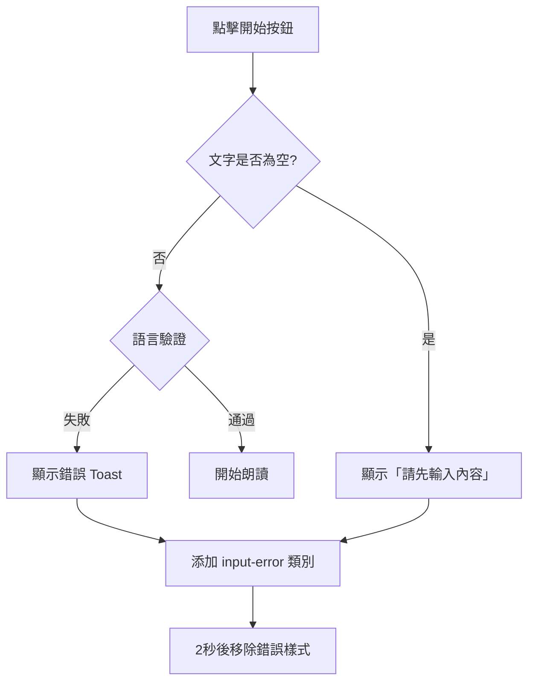

# Design Document: Text Language Validation

## Overview

本設計文件描述「默書神器」應用程式的文字語言驗證功能。此功能在使用者點擊「開始」按鈕時，根據所選語言驗證輸入文字是否符合要求：
- 粵語/普通話模式：文字必須包含中文字符
- 英語模式：文字不能包含中文字符

## Architecture

驗證功能將整合到現有的 `startReading()` 函數中，在空白檢查之後、朗讀開始之前執行。

```
┌─────────────────────────────────────────────────────────┐
│                    startReading()                        │
├─────────────────────────────────────────────────────────┤
│  1. 獲取輸入文字和語言設定                               │
│  2. 空白檢查 (現有邏輯)                                  │
│  3. ★ 語言驗證 (新增) ★                                 │
│     └─ validateTextForLanguage(text, lang)              │
│  4. 開始朗讀 (現有邏輯)                                  │
└─────────────────────────────────────────────────────────┘
```

## Components and Interfaces

### 1. TextLanguageValidator 模組

新增一個驗證模組，包含以下函數：

```javascript
/**
 * 檢查文字是否包含中文字符
 * @param {string} text - 要檢查的文字
 * @returns {boolean} - 是否包含中文字符
 */
function containsChinese(text) {
    // 使用 Unicode 範圍檢測中文字符
    // CJK Unified Ideographs: \u4e00-\u9fff
    // CJK Unified Ideographs Extension A: \u3400-\u4dbf
    // CJK Compatibility Ideographs: \uf900-\ufaff
    const chineseRegex = /[\u4e00-\u9fff\u3400-\u4dbf\uf900-\ufaff]/;
    return chineseRegex.test(text);
}

/**
 * 檢查文字是否為純英文（不含中文）
 * @param {string} text - 要檢查的文字
 * @returns {boolean} - 是否為純英文
 */
function isEnglishOnly(text) {
    // 移除空白字符後檢查是否包含中文
    const trimmedText = text.replace(/\s/g, '');
    if (trimmedText === '') return true; // 空白由其他邏輯處理
    return !containsChinese(text);
}

/**
 * 根據語言驗證文字
 * @param {string} text - 輸入文字
 * @param {string} lang - 語言代碼 ('zh-HK', 'zh-CN', 'en-GB')
 * @returns {{valid: boolean, errorMessage: string|null}}
 */
function validateTextForLanguage(text, lang) {
    // 移除空白字符進行驗證
    const trimmedText = text.replace(/\s/g, '');
    
    // 空白文字由現有邏輯處理
    if (trimmedText === '') {
        return { valid: true, errorMessage: null };
    }
    
    if (lang === 'zh-HK') {
        if (!containsChinese(text)) {
            return { 
                valid: false, 
                errorMessage: '粵語模式請輸入中文文字' 
            };
        }
    } else if (lang === 'zh-CN') {
        if (!containsChinese(text)) {
            return { 
                valid: false, 
                errorMessage: '普通話模式請輸入中文文字' 
            };
        }
    } else if (lang === 'en-GB') {
        if (containsChinese(text)) {
            return { 
                valid: false, 
                errorMessage: '英語模式請輸入英文文字' 
            };
        }
    }
    
    return { valid: true, errorMessage: null };
}
```

### 2. startReading() 函數修改

在現有的 `startReading()` 函數中，於空白檢查之後加入語言驗證：

```javascript
async function startReading() {
    const mode = document.querySelector('input[name="mode"]:checked').value;
    const rawText = document.getElementById('words').value;
    const text = sanitizeInput(rawText);
    const lang = document.getElementById('langSelect').value;
    const selectedVoice = document.getElementById('voiceSelect').value;
    
    // 空狀態處理 (現有邏輯)
    if (text.trim() === '') {
        updateStatus('請先輸入內容', '');
        const textarea = document.getElementById('words');
        textarea.focus();
        textarea.classList.add('input-error');
        setTimeout(() => textarea.classList.remove('input-error'), 2000);
        return;
    }
    
    // ★ 新增：語言驗證 ★
    const validation = validateTextForLanguage(text, lang);
    if (!validation.valid) {
        showErrorToast(validation.errorMessage);
        const textarea = document.getElementById('words');
        textarea.focus();
        textarea.classList.add('input-error');
        setTimeout(() => textarea.classList.remove('input-error'), 2000);
        return;
    }
    
    // ... 繼續現有的朗讀邏輯
}
```

## Data Models

### ValidationResult

```typescript
interface ValidationResult {
    valid: boolean;           // 驗證是否通過
    errorMessage: string | null;  // 錯誤訊息（驗證失敗時）
}
```

### Language Codes

| 語言代碼 | 語言名稱 | 驗證規則 |
|---------|---------|---------|
| zh-HK | 粵語 | 必須包含中文字符 |
| zh-CN | 普通話 | 必須包含中文字符 |
| en-GB | 英語 | 不能包含中文字符 |

## Correctness Properties

*A property is a characteristic or behavior that should hold true across all valid executions of a system—essentially, a formal statement about what the system should do. Properties serve as the bridge between human-readable specifications and machine-verifiable correctness guarantees.*

### Property 1: Chinese Mode Validation

*For any* text string and Chinese language mode (zh-HK or zh-CN), the validation function should return `valid: true` if and only if the text contains at least one Chinese character.

**Validates: Requirements 1.1, 1.2, 1.3, 2.1, 2.2, 2.3**

### Property 2: English Mode Validation

*For any* text string and English language mode (en-GB), the validation function should return `valid: true` if and only if the text does not contain any Chinese characters.

**Validates: Requirements 3.1, 3.2, 3.3, 5.2**

### Property 3: Mixed Text Handling

*For any* text string containing both Chinese and non-Chinese characters, the validation function should:
- Return `valid: true` for Chinese modes (zh-HK, zh-CN)
- Return `valid: false` for English mode (en-GB)

**Validates: Requirements 5.1, 5.3**

### Property 4: Whitespace Invariance

*For any* text string, adding or removing whitespace characters (spaces, tabs, newlines) should not change the validation result.

**Validates: Requirements 5.3**

## Error Handling

### 驗證失敗處理流程



### 錯誤訊息對照表

| 語言模式 | 錯誤條件 | 錯誤訊息 |
|---------|---------|---------|
| 粵語 (zh-HK) | 不含中文 | 粵語模式請輸入中文文字 |
| 普通話 (zh-CN) | 不含中文 | 普通話模式請輸入中文文字 |
| 英語 (en-GB) | 包含中文 | 英語模式請輸入英文文字 |

## Testing Strategy

### Unit Tests

單元測試將驗證核心驗證函數的行為：

1. **containsChinese() 函數測試**
   - 純中文字串應返回 true
   - 純英文字串應返回 false
   - 混合字串應返回 true
   - 空字串應返回 false

2. **isEnglishOnly() 函數測試**
   - 純英文字串應返回 true
   - 包含中文的字串應返回 false
   - 空字串應返回 true

3. **validateTextForLanguage() 函數測試**
   - 各語言模式的正確驗證結果
   - 錯誤訊息的正確性

### Property-Based Tests

使用 fast-check 進行屬性測試，每個測試至少執行 100 次迭代。

測試標籤格式：**Feature: text-language-validation, Property N: [property_text]**

1. **Property 1 測試**: 生成隨機中文字串和非中文字串，驗證中文模式的驗證邏輯
2. **Property 2 測試**: 生成隨機字串，驗證英語模式的驗證邏輯
3. **Property 3 測試**: 生成混合字串，驗證不同模式下的處理
4. **Property 4 測試**: 生成帶有隨機空白的字串，驗證空白不影響結果

### Integration Tests

整合測試將驗證 UI 行為：

1. 驗證失敗時 error toast 是否正確顯示
2. 驗證失敗時 input-error 類別是否正確添加和移除
3. 驗證通過時朗讀是否正常開始
